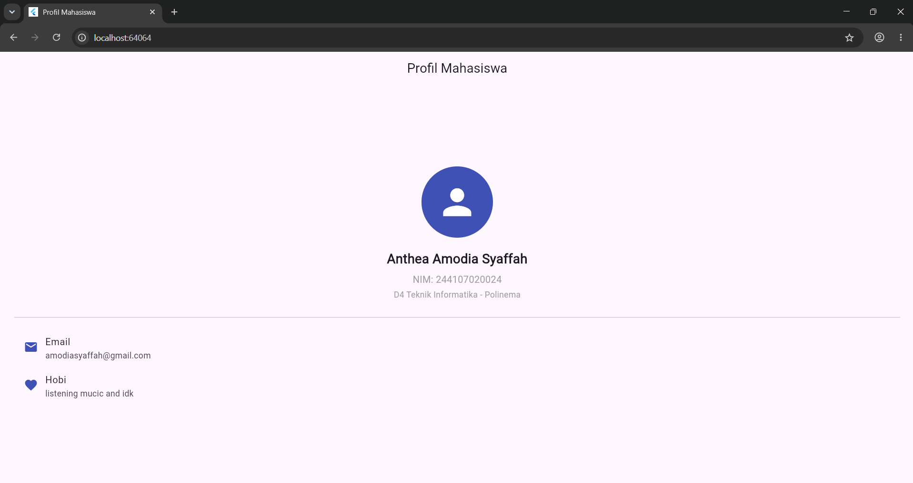
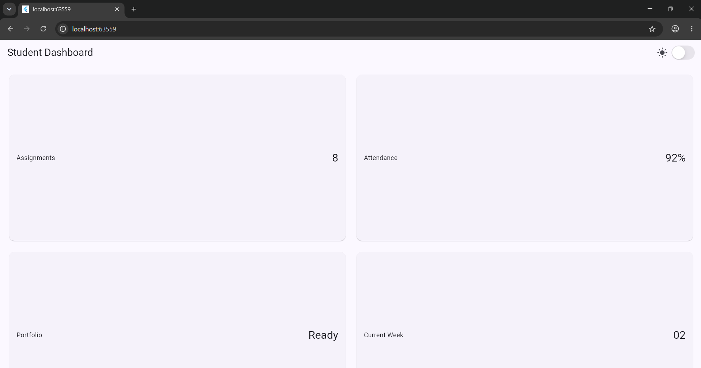
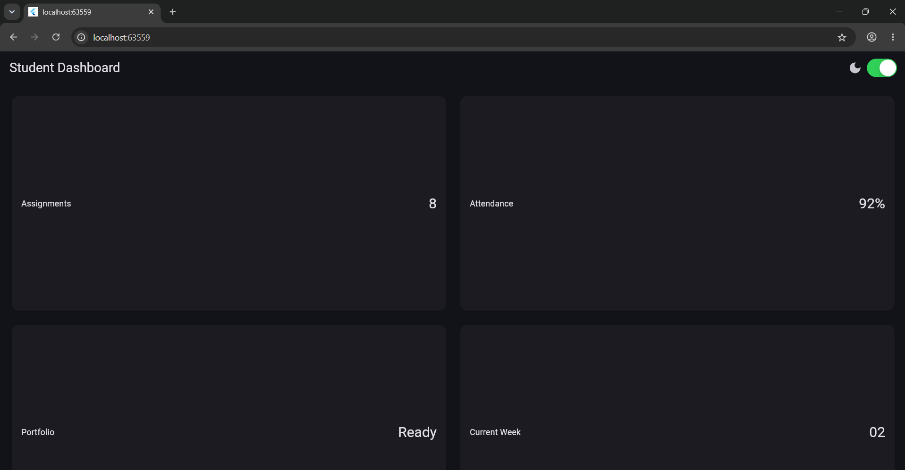
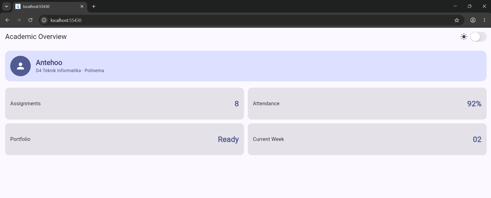
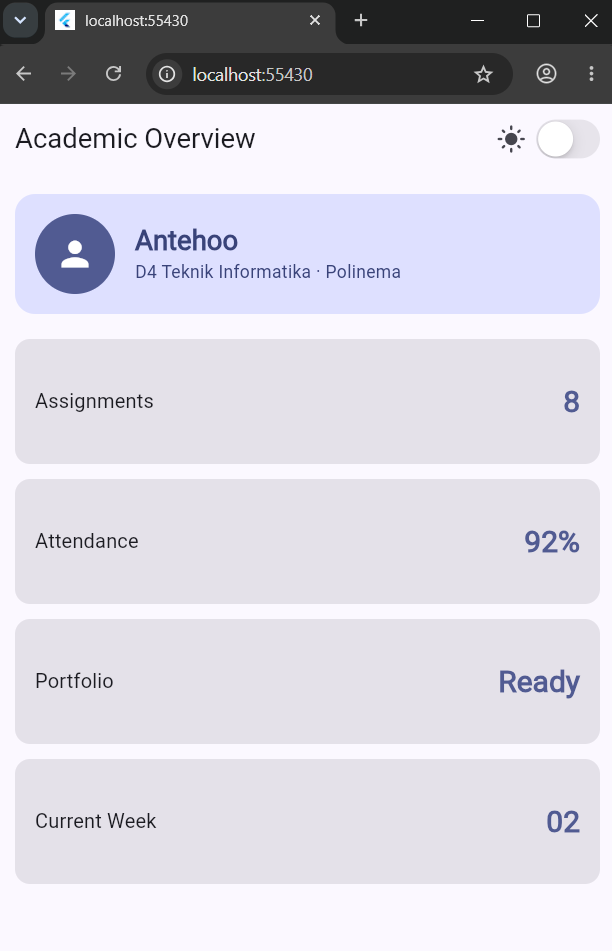
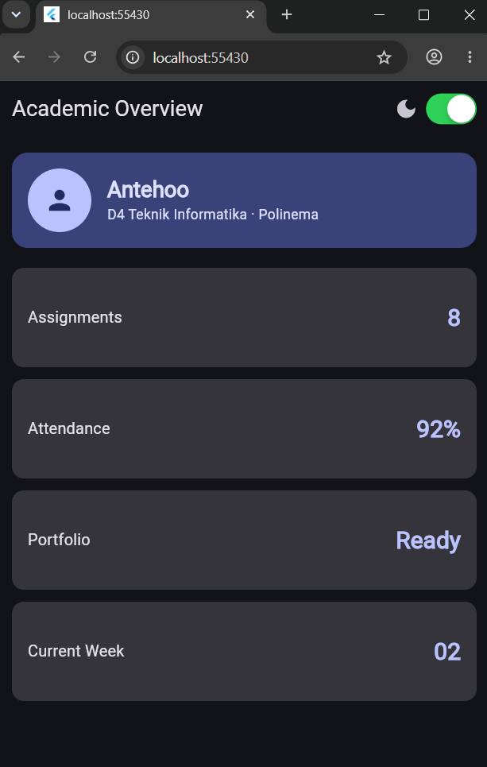

## 📸 Hasil Screenshot & Tampilan Aplikasi

### 1. Layout Sederhana (Praktikum 4)
Berikut adalah hasil tampilan implementasi kode pada Praktikum 4:

<p align="center">
  
</p>

---

### 2. Dashboard Responsif (Praktikum 5)
Berikut adalah hasil tampilan implementasi layout dashboard responsif:

| Tampilan Desktop / Luas | Tampilan Mobile / Sempit |
| :---: | :---: |
|  |  |

---

### 3. Tugas Utama (Praktikum 5)
Berikut adalah hasil pengujian dan tampilan dari tugas utama:

| Preview 1 | Preview 2 | Preview 3 |
| :---: | :---: | :---: |
|  |  |  |

#  AI Prompt Challenge AI

### 1.  Prompt Desain: GridView vs LayoutBuilder + Column
* **Perbandingan Pendekatan:**
  * **GridView:** Lebih sederhana dan otomatis mengatur item ke baris berikutnya berdasarkan `crossAxisCount`. Sangat cocok untuk dashboard dengan banyak card seragam. *Catatan:* Perlu memperhatikan `childAspectRatio` agar card tidak terpotong.
  * **LayoutBuilder + Row/Column:** Memberikan kontrol ukuran yang lebih fleksibel secara eksplisit, meski membutuhkan baris kode yang sedikit lebih panjang.
* **Aspek Lainnya:**
  * **Aksesibilitas:** Kedua pendekatan tidak otomatis unggul; aksesibilitas bergantung pada implementasi widget di dalamnya (seperti penggunaan `Semantics`).
  * **Pemeliharaan Kode:** `GridView` lebih praktis untuk menjaga keseragaman struktur kode.
* **Rekomendasi:** Penggunaan disesuaikan dengan kebutuhan kompleksitas tampilan dan konsistensi card data.

---

### 2.  Prompt Penguatan Konsep: Expanded & Flexible
* **Kondisi Error pada `Expanded`:**
  `Expanded` membutuhkan parent dengan ukuran yang jelas (*bounded*). Jika dimasukkan ke dalam `Row` yang berada di dalam `SingleChildScrollView` horizontal (yang lebarnya *unbounded*), Flutter akan mengalami error/crash karena tidak dapat menentukan sisa ruang secara pasti.
  
  * **Contoh Kode yang Salah:**
    ```dart
    SingleChildScrollView(
      scrollDirection: Axis.horizontal,
      child: Row(
        children: [
          Expanded(child: Container(color: Colors.red, height: 50)), // ❌ ERROR
          Container(width: 100, color: Colors.blue),
        ],
      ),
    )
    ```
  * **Solusi Perbaikan:**
    Gunakan lebar tetap (`width`) alih-alih `Expanded` pada *infinite scroll container*:
    ```dart
    SingleChildScrollView(
      scrollDirection: Axis.horizontal,
      child: Row(
        children: [
          Container(width: 200, color: Colors.red, height: 50), 
          Container(width: 100, color: Colors.blue),
        ],
      ),
    )
    ```
* **Perbedaan `Expanded` vs `Flexible`:**
  * `Expanded`: Memaksa *child* untuk mengisi seluruh ruang sisa yang tersedia.
  * `Flexible`: Hanya memberi batas maksimal (*loose*), sehingga *child* tetap bisa berukuran lebih kecil dari sisa ruang yang ada.

---

### 3.  Verification Prompt:
* **Pengujian Layar < 600px:** 
   Layout kartu tugas menggunakan breakpoint (`kWideBreakpoint = 700`), sehingga pada layar di bawah 600px akan otomatis menyesuaikan ke jalur 1-kolom.
* **Pencegahan Overflow:**
  * `Container` card menggunakan `height: 100` berisi `Row` dengan kombinasi satu `Expanded(Text)` dan satu `Text` angka untuk mencegah teks terpotong.
* **Kompatibilitas Flutter Stable:**
  Seluruh widget dan properti yang digunakan dipastikan tersedia pada versi stable, meliputi: `LayoutBuilder`, `Row`, `Column`, `Expanded`, `Container`, `CupertinoSwitch`, dan `Semantics`.

---

##  Cara Menjalankan

```bash
# 1. Masuk ke folder project
cd nama-folder-project

# 2. Install dependencies
flutter pub get

# 3. Jalankan aplikasi
flutter run lib/main.dart
