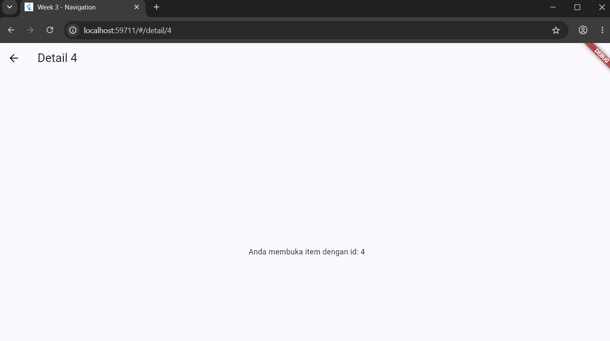
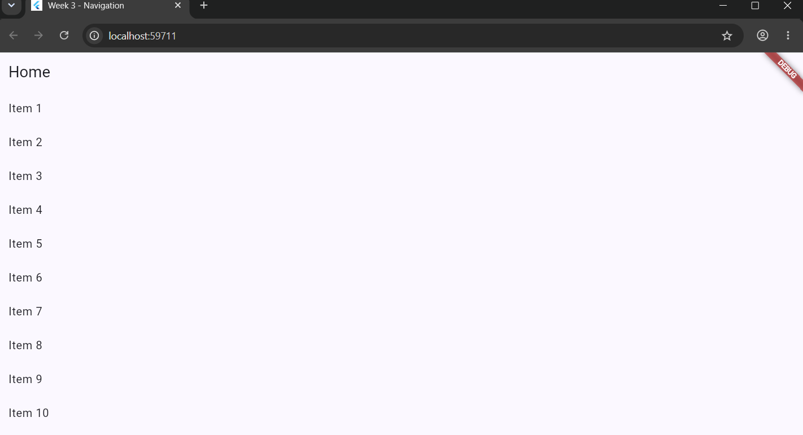
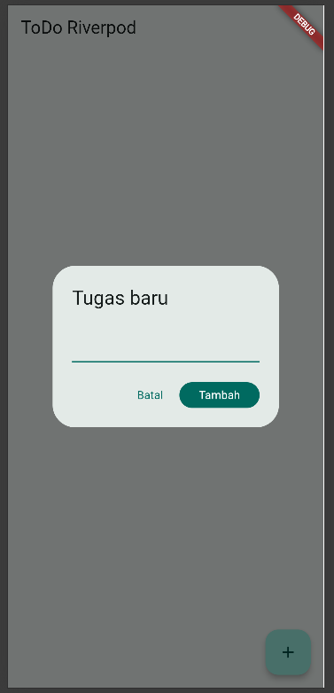
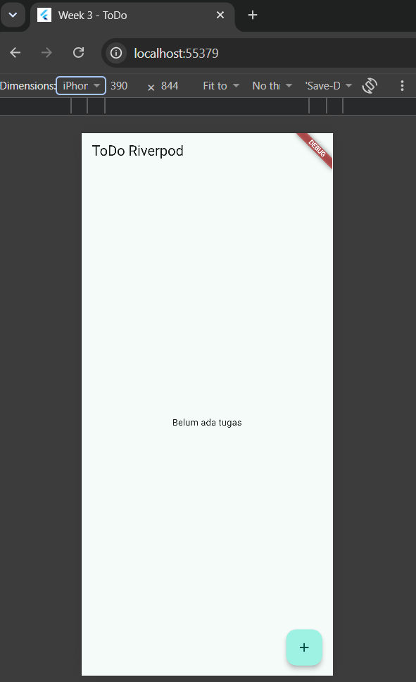
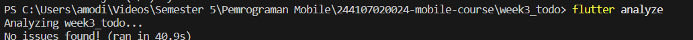

# Week 3 - ToDo App & Async State Management

## Dokumentasi Hasil Praktikum 1
| Home Page | Detail Page |
| :---: | :---: |
|  |  |

### 1. Tampilan Awal 

### 2. Tampilan tambah tugas

### 3. Tampilan daftar tugas

### 4. Tampilan daftar tugas sudah selesai

# AI Challenge — Dokumentasi

## 1. Prompt yang Digunakan
Buatkan halaman Flutter bernama StatsPage menggunakan flutter_riverpod.
Requirements:
- ConsumerWidget dengan satu AsyncNotifierProvider yang mensimulasikan
  pengambilan data statistik (delay 2 detik, kadang gagal 30%).
- UI harus menangani loading (spinner), error (pesan + tombol retry),
  dan success (ListView 3 item).
- Berikan unit test untuk notifier-nya.
- Jelaskan setiap bagian kode dalam komentar.
- Tambahan: pisahkan logika simulasi fetch (delay + peluang gagal)
  menjadi fungsi top-level yang menerima parameter opsional
  randomValue, supaya bisa diuji secara deterministik tanpa
  bergantung pada angka acak sungguhan.

**Struktur Unit Test:**
*   **Awalnya:** Unit test-nya mwncoba memanggil provider asli berkali-kali terus berharap mendapat kondisi gagal/berhasil.
*   **Masalahnya:** Jadinya *flaky*, waktu test-nya jadi lama, dan hasilnya nggak konsisten.
*   **Perbaikannya:** memakai `provider.overrideWith(...)` dengan *fake notifier* buat misahin test dari efek samping seperti *delay* dan *random*.

**Cek Manual:**
*   Memastikan `ref.watch` hanya ditaruh di dalam `build() untuk otomatis *rebuild* layarnya.
*   Memastikan `ref.read` hanya dipakai saat *callback* tombol *retry*, sesuai aturan dari modul.
*   Memastikan nggak ada yang mengubah state secara langsung (misal pakai `state.add()`), semua update state pakai penugasan baru (`state = ...`).

### 3. Hasil Verifikasi Checklist

| Pertanyaan Checklist | Keterangan |
| :--- | :---: |
| State diubah secara *immutable*? | ya |
| `ref.watch` cuma di `build()`, `ref.read` di *callback*? | benar |
| Ketiga state `AsyncValue` ditangani? | pakai `.when()`|
| Provider tipe eksplisit & tidak duplikat? | pakai `AsyncNotifierProvider<StatsNotifier, List<String>>`. |
| Pakai API Riverpod modern? | memakai `AsyncNotifier` + `ConsumerWidget` |
| Lolos `flutter analyze` & `flutter test`? |      |

### Refleksi

**1. Kapan `setState` masih cukup, dan kapan state harus naik ke Riverpod?**
pakai setState kalau urusannya cuma buat satu layar aja dan nggak ngaruh ke halaman lain.

**2. Apa perbedaan `context.go` dan `context.push`, dan kapan masing-masing tepat digunakan?**
*   **`context.go`** mengganti lokasi saat ini di dalam riwayat navigasi (menimpa halaman, bukan menumpuk). Sangat cocok untuk perpindahan antar *tab* yang sejajar (seperti pada *Bottom NavigationBar*), di mana tidak ada konsep hierarki halaman yang lebih dalam, sehingga tombol *back* tidak diperlukan.
*   **`context.push`** menambahkan halaman baru di atas tumpukan riwayat yang sudah ada. Sangat cocok digunakan untuk masuk lebih dalam ke suatu alur spesifik (misal: dari daftar tugas menelusuri ke detail satu tugas tertentu). Dengan ini, tombol *back* otomatis aktif dan riwayat halaman sebelumnya tidak hilang.

**3. Bagaimana `AsyncValue` mencegah bug dibanding tiga boolean terpisah?**
*   Kalau kita bikin variabel manual (isLoading, isError, hasData), sering banget kejadian human error—contohnya data udah muncul, tapi spinner loadingnya masih muter karena lupa di-set false. kalau pakai AsyncValue  sistem memaksa cuma bisa 1 kondisi dalam 1 waktu

**4. Bagian mana dari hasil AI yang diperbaiki, dan mengapa?**
Beberapa perbaikan teknis yang dilakukan pada kode hasil keluaran AI antara lain:
*   **Memisahkan logika *fetch* menjadi fungsi *top-level*:** Logika *delay* dan angka acak (*random* untuk probabilitas error 30%) dikeluarkan dari kelas Notifier agar aplikasi lebih mudah diuji (*testable*). Hal ini membuat kita bisa menyuntikkan data palsu (*mock/fake*) yang deterministik saat *unit test*, sehingga mencegah *test* gagal secara acak (*flaky*).
*   **Menyesuaikan strategi tunggu pada Widget Test:** Mengganti metode `.pump()` dari AI menjadi `.pumpAndSettle()`. Hal ini wajib diperbaiki karena transisi dari *GoRouter* dan animasi *pop-up dialog* membutuhkan waktu render beberapa *frame*, sehingga robot *tester* tidak terburu-buru melakukan pengecekan layar sebelum komponen selesai dimuat.
*   **Pengamanan error dengan `AsyncValue.guard`:** Mengganti blok `try-catch` manual buatan AI pada fitur *retry* menggunakan metode bawaan Riverpod ini, agar transisi antara state *loading*, *error*, dan *data* tertangani jauh lebih rapi dan aman.

